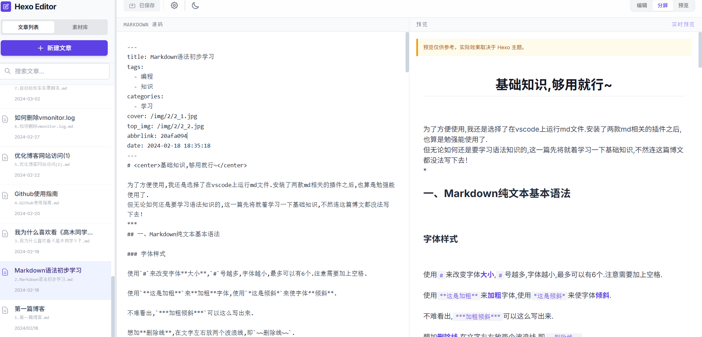

## Hexo-Butterfly Editor

**一句话说明**: 面向 Hexo + Butterfly 主题的本地 Markdown 编辑器与素材管理器，提供便捷的文章（`source/_posts`）和图片（`source/img`）的本地编写、上传与预览能力；前端基于 Vite + React，后端为轻量 Express API。

**示意图**



**主要功能**
- **文章管理**: 列表、创建、编辑、保存、删除 Markdown 文件。
- **图片管理**: 列出站点图片、上传图片（支持按文章子目录存放）、复制图片引用路径。
- **实时预览**: 在编辑器中查看 Markdown 的大致渲染结果（实际主题效果以 Hexo 主题为准）。
- **本地配置**: 后端会生成 `config.json` 保存 `postsPath` 与 `imagesPath`（仅本地使用）。

**适用场景**
- 在本地直接编辑 Hexo 博客文章并管理图片，适合使用 Butterfly 主题或希望在本地快速编写/测试文章的用户。
- 需要注意的是markdown语法仅部分支持

**前提条件**
- Node.js >= 18
- npm（或 yarn / pnpm）

**快速开始（开发模式）**
- 克隆并安装依赖：

```powershell
cd hexolocal-editor
npm install
```

- 启动开发环境（同时启动后端 API 与 Vite 前端）：

```powershell
npm run dev
```

- 打开浏览器访问： `http://localhost:5173`

**配置（`config.json`）**
- 应用通过后端读取 `config.json` 来确定 Hexo 的文章与图片目录。首次在前端保存设置或后端读取不到配置时，会提示填写路径；保存后后端会在仓库根生成 `config.json`，示例格式：

```json
{
  "postsPath": "C:/path/to/your/hexo/source/_posts",
  "imagesPath": "C:/path/to/your/hexo/source/img"
}
```

- 注意：Windows 路径建议使用正斜杠或双反斜杠，且确保 Node 进程有读/写权限。

**端口与代理**
- 后端默认监听 `http://localhost:3000`。
- Vite 开发服务器默认 `http://localhost:5173`，并通过 `vite.config.ts` 中的 `server.proxy` 将以 `/api` 开头的请求代理到后端，因此前端代码使用相对地址 `/api`。


**常见问题与排查**
- **页面只有深色背景但无 UI**:
  - 确认启动命令为 `npm run dev`（而不是 `npm dev run`）；确保 Vite 已启动（终端会显示 `Local:` 地址）。
  - 打开浏览器开发者工具（F12）查看 `Console` 与 `Network`：
    - 若有加载模块/资源的 404 或跨域错误（CORS），前端可能无法正常渲染。
    - 如果看到 React/ReactDOM 版本或 renderer 冲突的错误，通常是 `index.html` 中存在 `importmap` 或页面强制加载了 CDN 版本导致的，本项目已从 `index.html` 中移除 CDN importmap，确保本地使用 `node_modules`。 
- **无法读取/写入文章或图片**:
  - 检查 `server.js` 是否正常运行（`npm run dev` 时 server 会在 3000 端口启动）。
  - 检查 `config.json` 中的 `postsPath` 与 `imagesPath` 是否为正确的 Hexo 目录，且 Node 进程有权限访问。

### 如有问题欢迎提issue